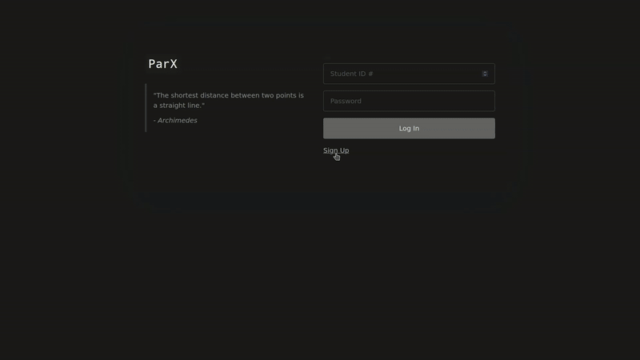

<p align="center">
  
  
</p>

## Features
* Fully functioning login + signup screen.
* Privacy through password hashing + salting and (sometimes even redunant) data validation.
* The ability for users to see and sign up for school events.
* A screen for users to see the points they have accumulated for attending those events.
* Teachers can create new events, modify existing ones, and distribute points to users who have attended them.
* A report can be created to show who is at the top of the point leaderboard so that prizes can be distributed.
* FAQ and Bug Reporting available throughout the site.

## Installation
### Dependencies
* MySQL (or MariaDB)
* GO >= 1.19 (if compiling from source only)

### ⚠️ This project is intended to be run server-side, so setup involves creating a MySQL database and running a local instance of the webapp. Follow steps below carefully. ⚠️ 
### Quick Start (Most Users)
1. Navigate over to the releases tab and install ```createDatabase.sql``` and ```PARX-WebApp.exe```.
2. Execute the ```createDatabase.sql``` file to generate the database and populate it with sample data.
  * Option A: GUI using MySQL Workbench (Information derived from )
    * Open the application and log in with your username and password.
    * Navigate to the Server Administration tab
    * Click on Manage Import/Export
    * Click on Data Import/Restore (on the left side of the screen).
    * Select Import from Self-Contained File and input the path to createDatabase.sql.
    * Hit the start import button.
    * Finally, execute the script.
  * Option B (Command line)
    * If you have never used MySQL before, enter the installation utility and follow the steps:
      ```bash
      sudo mysql_secure_installation
    
    * Then, log in
      ```bash
      mysql -u {USERNAME} -p
    * Finally, to execute the createDatabase.sql file:
      ```mysql
      source full/path/to/createDatabase.sql
    * To re-run this script in the future (should not be neccesary), make sure you execute this before re-running:
      ```mysql
      drop schema `fbla`;
  2. Execute the binary ```PARX-WebApp.exe```.
  3. Open a web browser and navigate to localhost:8082.
  4. Enjoy!
      
### Advanced Setup (Compiling from Source)
1. Navigate over to the releases tab and download the source code file.
2. Extract the archive.
3. In a terminal instance execute these commands to compile the binary:
   ```bash
   cd path/to/extracted/PARX-WebApp-v-1.0.1
   go build .
 4. Run the SQLSetup/createDatabase.sql script in a mySQL connection.
  * See instructions in Quick Start.
 5. Finally, run the executable you compiled:
    ```bash
    cd path/to/extracted/PARX-WebApp-v-1.0.1
    ./PARX-WebApp
## Built By
* @givingdonation - Carlo Allietti (Dev 1)
* @luhi1 - Michael Borov (Dev 2)
* @ChadicalRadical - Chad Khan (Graphic Design)
